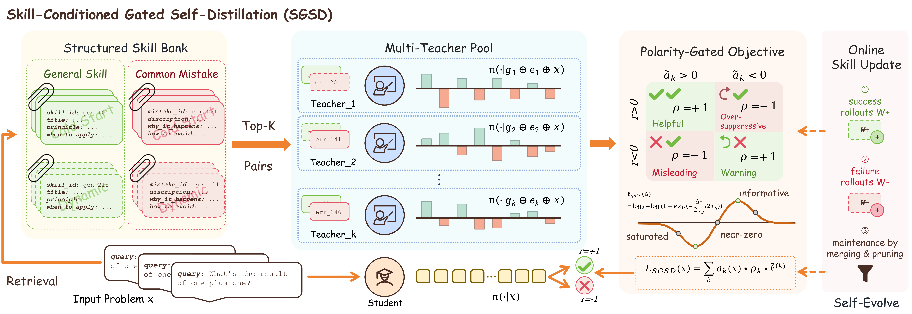

# SGSD: Skill-Conditioned Gated Self-Distillation for LLM Reasoning

<p align="center">
  <a href="https://arxiv.org/abs/2605.28791"></a>
  <a href="LICENSE"></a>
</p>

This is the official implementation of **Skill-Conditioned Gated Self-Distillation for LLM Reasoning**.

<p align="center">

</p>

## News

- **[06/05/2026]** The initial code of SGSD has been released.
- **[05/27/2026]** We released the SGSD paper on [arXiv](https://arxiv.org/abs/2605.28791).

## Overview

SGSD uses an experience-derived skill bank as teacher-side privileged information for on-policy self-distillation. Retrieved skill-mistake pairs define a pool of teachers, and a gated objective validates their token-level supervision against verifier outcomes before updating the student.

<details>
  <summary><strong>Abstract</strong></summary>

  On-policy self-distillation (SD) improves LLM reasoning by using teacher-side privileged information (PI) to turn sparse verifier outcomes into dense token-level supervision. Existing methods usually assume trusted PI, such as reference answers or successful traces. We ask whether PI can instead come from an experience-derived skill bank, where retrieved skills are compact and reusable but may also be irrelevant or misleading. We propose **S**kill-Conditioned **G**ated **S**elf-**D**istillation (**SGSD**), which formulates skill-based SD as teacher hypothesis validation rather than unconditional imitation. SGSD retrieves skill-mistake pairs, constructs a multi-teacher pool, and lets all skill-conditioned teachers score the same plain-prompt student rollout. The verifier validates each teacher's polarity: supporting a success or suppressing a failure gives positive supervision, while the opposite stance is reversed. A robust gated objective then distills informative teacher-student disagreements while suppressing uncertain or extreme signals. Experiments on multiple mathematical reasoning benchmarks show that SGSD consistently improves over GRPO and remains competitive with answer-conditioned OPSD under a weaker PI assumption. For example, on Qwen3-1.7B, SGSD outperforms GRPO by 6.2% and OPSD by 1.7% on average on AIME24, AIME25, and HMMT25.

</details>

## Key Features

- **SGSD training**: teacher-only skill conditioning, rank-aligned skill-mistake teachers, outcome-validated polarity, and gated token-level self-distillation.
- **Skill bank lifecycle**: cold-start memory generation, per-trajectory skill extraction, hierarchical merge, retrieval, and optional online maintenance.
- **Math evaluation**: plain-prompt evaluation for trained checkpoints and a dedicated Base+Skill evaluation entry.
<!-- - **Baselines**: OPSD, OPSD+Skill, GRPO, and GRPO+Skill are kept as reproducible comparison entries. -->
<!-- - **Public data support**: direct adapter support for [BytedTsinghua-SIA/DAPO-Math-17k](https://huggingface.co/datasets/BytedTsinghua-SIA/DAPO-Math-17k), with compatibility for the earlier string-field schema. -->

## Main Results

We report avg@12 accuracy for Qwen3-1.7B. SGSD uses skill PI only on the teacher side during training and evaluates with plain prompts.

<div align="center">
<table>
<tr>
<th align="center">AIME24</th>
<th align="center">AIME25</th>
<th align="center">HMMT25</th>
</tr>
<tr>
<td>

| Method | Avg@12 |
|---|---|
| Base | 51.1% |
| Base+Skill | 49.2% |
| GRPO | 50.0% |
| GRPO+Skill | 52.2% |
| OPSD | 55.8% |
| OPSD+Skill | 54.4% |
| **SGSD** | **57.8%** |

</td>
<td>

| Method | Avg@12 |
|---|---|
| Base | 36.9% |
| Base+Skill | 38.3% |
| GRPO | 36.7% |
| GRPO+Skill | 38.9% |
| OPSD | 43.3% |
| OPSD+Skill | 40.3% |
| **SGSD** | **43.6%** |

</td>
<td>

| Method | Avg@12 |
|---|---|
| Base | 24.2% |
| Base+Skill | 20.3% |
| GRPO | 25.8% |
| GRPO+Skill | 25.8% |
| OPSD | 26.9% |
| OPSD+Skill | 27.2% |
| **SGSD** | **29.7%** |

</td>
</tr>
</table>
</div>

## Installation

```bash
conda env create -f environment.yml
conda activate sgsd
pip install flash-attn==2.8.3 --no-build-isolation
```

The examples use [Qwen3](https://huggingface.co/Qwen), [DAPO-Math-17k](https://huggingface.co/datasets/BytedTsinghua-SIA/DAPO-Math-17k), TRL, Accelerate, and vLLM. Local model and dataset paths are also accepted.

## Quick Start

Run the Qwen3-1.7B SGSD paper configuration:

```bash
bash scripts/run_sgsd.sh
```

The script uses the bundled skill bank at `skill/artifacts/dapo_math/qwen3_1b/claude_style_skills.json`. Override defaults through environment variables:

```bash
MODEL_ID=Qwen/Qwen3-4B \
SKILLS_JSON_PATH=skill/artifacts/dapo_math/qwen3_4b/claude_style_skills.json \
OUTPUT_DIR=outputs/sgsd_qwen3_4b \
bash scripts/run_sgsd.sh
```

Baseline launch scripts:

```bash
bash scripts/run_opsd.sh
bash scripts/run_grpo.sh
```

To enable skill-injected variants, add `--use_skills true` to the original training scripts. 
<!-- These variants share the same training entries as their plain counterparts. -->

## Skill Banks

Bundled skill banks and the maintenance pipeline are documented in [skill/README.md](skill/README.md). In short:

- `generated_memories.json` stores sampled trajectories and verifier outcomes.
- `raw_skill_candidates.json` stores per-trajectory extracted skills and mistakes.
- `claude_style_skills.json` is the merged bank consumed by training and evaluation.

The public dataset adapter directly supports DAPO-Math-17k and remains compatible with the earlier string-field dataset format.

## Training

All training commands are launched with Accelerate and write outputs under `outputs/` by default. The scripts are intentionally small wrappers around the public Python entries, so you can either edit the script or override environment variables.

| Method | Entry | Script | Skill usage |
| --- | --- | --- | --- |
| SGSD | `sgsd_train.py` | `scripts/run_sgsd.sh` | Teacher-side skill-mistake pairs, optional online bank update |
| OPSD | `opsd_train.py` | `scripts/run_opsd.sh` | No skill injection |
| OPSD+Skill | `opsd_train.py --use_skills true` | `scripts/run_opsd_skill.sh` | Skills injected into OPSD training prompts |
| GRPO | `grpo_train.py` | `scripts/run_grpo.sh` | No skill injection |
| GRPO+Skill | `grpo_train.py --use_skills true` | `scripts/run_grpo_skill.sh` | Skills injected into GRPO rollout prompts |

The SGSD paper configuration uses:

| Setting | Value |
| --- | --- |
| Dataset | `BytedTsinghua-SIA/DAPO-Math-17k` |
| Student model | `Qwen/Qwen3-1.7B` |
| Skill bank | `skill/artifacts/dapo_math/qwen3_1b/claude_style_skills.json` |
| Retrieved skill pairs | 8 |
| Gate temperature | 1.0 |
| Local support | `--sgsd_local_support_top_k -1` for full-vocabulary normalization |
| Polarity clip | 3.0 |
| Confidence threshold | 0.05 |
| Dynamic update | every 25 steps, threshold 0.8, max new items 5, capacity 30 |

Common environment overrides:

```bash
MODEL_ID=Qwen/Qwen3-1.7B
DATASET_ID=BytedTsinghua-SIA/DAPO-Math-17k
SKILLS_JSON_PATH=skill/artifacts/dapo_math/qwen3_1b/claude_style_skills.json
OUTPUT_DIR=outputs/sgsd
CUDA_VISIBLE_IDS=0,1,2,3
NUM_PROCESSES=4
MAIN_PROCESS_PORT=12964
```

Training automatically resumes from the latest checkpoint in `OUTPUT_DIR` when one exists. SGSD writes online skill-bank snapshots to `outputs/sgsd/skill/` unless `--skills_save_path` is overridden.

## Evaluation

Evaluate a base model or trained checkpoint with plain prompts:

```bash
bash eval/run_eval.sh
CHECKPOINT_DIR=outputs/sgsd/checkpoint-200 bash eval/run_eval.sh
```

To evaluate with skills injected at inference:

```bash
bash eval/run_eval_with_skill.sh
```
<!-- SGSD, OPSD+Skill, and GRPO+Skill checkpoints are evaluated with plain prompts in the paper. `eval/evaluate_math_with_skill.py` is retained for Base+Skill and other inference-time skill-injection comparisons. -->

## Citation

If you find this work helpful, please consider citing:

```bibtex
@article{huang2026skill,
  title={Skill-Conditioned Gated Self-Distillation for LLM Reasoning},
  author={Huang, Jiazhen and Chen, Xiao and Luo, Xiao and Dai, Yong and Hu, Senkang and Zhao, Yuzhi},
  journal={arXiv preprint arXiv:2605.28791},
  year={2026}
}
```

## Acknowledgements

This code builds on [OPSD](https://github.com/siyan-zhao/OPSD), [SkillRL](https://github.com/aiming-lab/SkillRL), [TRL](https://github.com/huggingface/trl), and the broader open-source reasoning community.

## License

Released under the [MIT License](LICENSE).
